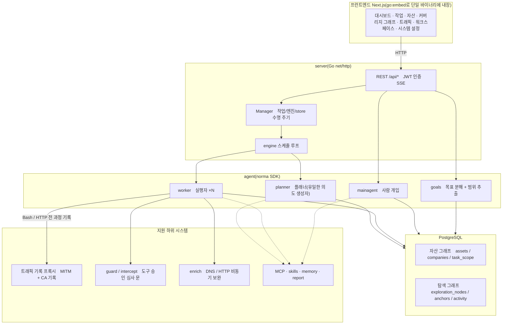
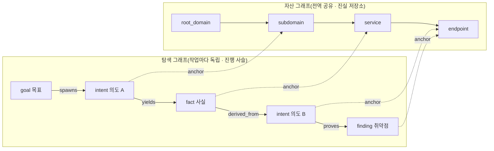
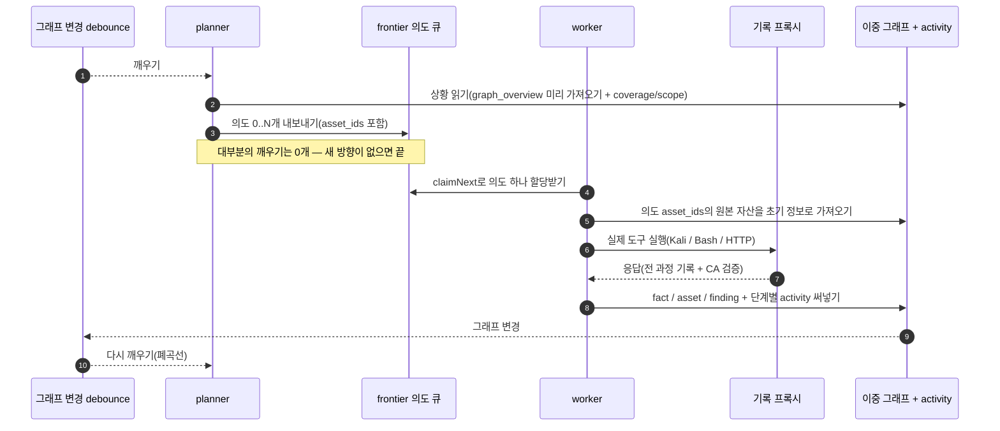
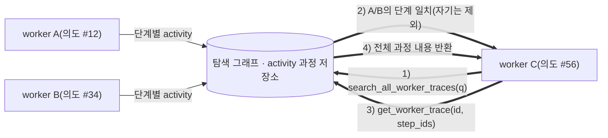
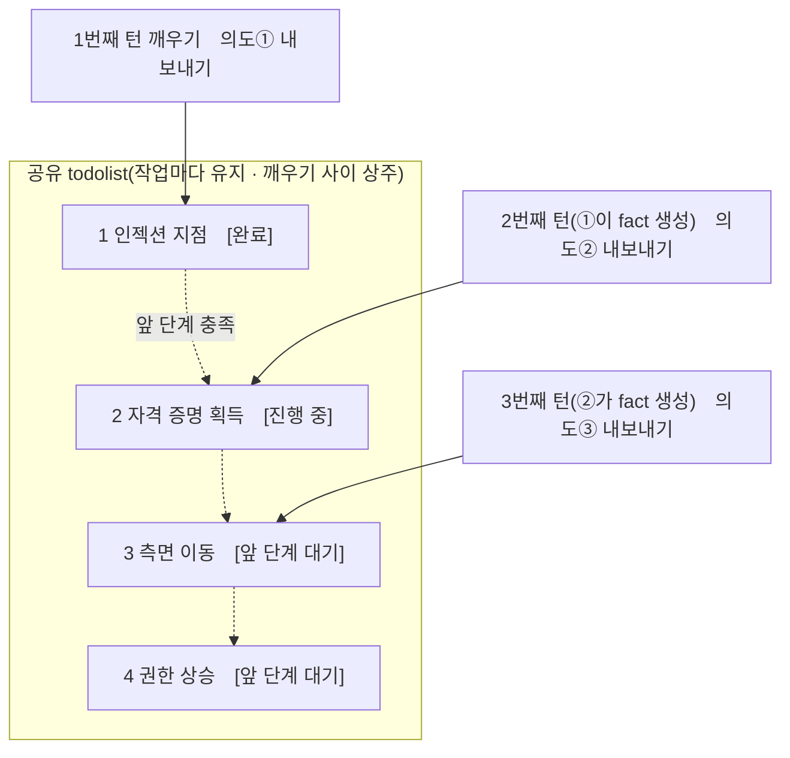

<div align="center">

# ARTEX

AI 자율 침투 테스트 시스템(Go 백엔드 + Next.js 프런트엔드)


🌐 **온라인 데모**: [https://artex-demo.vercel.app/](https://artex-demo.vercel.app/)

</div>

---

## 화면 미리 보기

> 전체 동작은 [온라인 데모](https://artex-demo.vercel.app/)에서 확인합니다.

| 대시보드(개요 / 토큰 사용량 / 활동 피드) | 작업 목록 |
| :---: | :---: |
|  |  |

| 작업 · 실행 과정(세션 / 도구 호출) | 탐색 경로 |
| :---: | :---: |
|  |  |

| 발견 사항 | 자산 |
| :---: | :---: |
|  |  |

| 자산 커버리지 그래프(포스 기반 배치 · 테스트 완료 강조 · 노드 접기·펼치기) |
| :---: |
|  |

| 트래픽 기록 | 사람이 개입하는 대화 |
| :---: | :---: |
|  |  |

| 에이전트 관리 | LLM 프로필 |
| :---: | :---: |
|  |  |

| 차단 승인 심사 | 백엔드 로그 |
| :---: | :---: |
|  |  |


---

## 승인 심사 기록 상세

전역 '승인 심사 기록', 작업 안의 '차단 승인 심사', 대화 속 승인 심사 카드는 모두 펼쳐서 상세를 볼 수 있다. 표시 구조는
[AegisHook의 승인 심사 상세 컴포넌트](https://github.com/RuoJi6/AegisHook/blob/main/web/src/components/CallDetail.vue)를 참고하고, ARTEX의 컴포넌트와 테마를 그대로 쓴다.


## 자산 동기화(ScopeSentry)

[ScopeSentry](https://github.com/Autumn-27/ScopeSentry)에서 자산 데이터를 바로 동기화해 중복 수집을 줄일 수 있다.

- '**자산 동기화**' 페이지에 ScopeSentry의 주소와 API Key를 입력해 데이터 소스를 연결한다.
- **프로젝트**나 **작업** 단위로 동기화할 대상과 자산 유형(도메인 / 하위 도메인 / IP / 포트 / 사이트 / 엔드포인트…)을 고른다.
- 한 번에 가져와 기업 자산 범위에 맞춰 묶으면, 바로 ARTEX의 자산 그래프에 들어가 에이전트가 탐색에 쓴다.

---

## Claude 구독 로그인

LLM 프로필에서 인증 방식을 **Claude 구독**으로 선택해 저장한 뒤 로그인한다. 새 탭에서 Claude 인증을 끝내고, 이동한 `http://localhost:53692/callback?…` 주소 전체 또는 `code#state`를 붙여 넣으면 연결된다. 콜백 주소의 연결 실패 화면은 정상이며 원격 서버에서도 같은 방법을 쓴다. 코드와 state는 다른 사람에게 공유하지 않는다.

연결 후 모델 목록 조회와 연결 테스트를 하고 사용할 모델을 고른다. 토큰은 서버에서 암호화 저장·자동 갱신하며 API 키나 사용자 지정 중계 주소를 쓰지 않는다. 인증 실패에는 한 번만 갱신·재요청하고 사용량 제한·서버 오류는 자동 재전송하지 않는다. 연결 해제와 재로그인은 같은 프로필 화면에서 한다.

OML에서 확인한 Claude Code 구독 OAuth 요청 조건을 적용한 기능이다. 제공자 정책·모델 권한은 달라질 수 있으므로 배포 전에 실제 구독 계정으로 로그인·연결 테스트·대화·연결 해제를 확인한다.

## 설치

> 데이터베이스 **PostgreSQL**이 필요하다. 탐색에는 **LLM** 설정이 필요하다(`ANTHROPIC_API_KEY` 또는 `OPENAI_API_KEY`, UI에서도 설정할 수 있다).

### 방법 1: 일괄 설치 스크립트(권장)

```bash
git clone https://github.com/LRTK-CODER/ARTEX.git
cd ARTEX
./install.sh
```

스크립트는 Docker를 감지한 뒤 **① 전부 Docker** 또는 **② 로컬 컴파일 실행**을 고르게 한다.

스크립트는 Docker를 설치하지 않는다. ① 또는 ②에서 Docker로 PostgreSQL을 띄우려면 먼저 [공식 설치 문서](https://docs.docker.com/engine/install/)대로 Docker와 Docker Compose 플러그인을 설치한다. 없으면 이 링크를 보여 주고 멈춘다.

- **① 전부 Docker**: Postgres 비밀번호를 하나 입력하면(엔터를 치면 무작위) `.env`를 자동으로 쓰고 `docker compose up -d`를 실행한다.
- **② 로컬 실행**: 데이터베이스를 고르고(기존 연결 / Docker로 하나 띄우기) `config.json`을 만든 뒤 `go`로 프런트엔드를 내장한 단일 바이너리를 컴파일해 실행한다.

설치가 끝나면 **http://localhost:8787**을 연다(처음에는 `/setup`에서 관리자 비밀번호를 설정한다).

### 방법 2: Docker Compose(수동)

```bash
git clone https://github.com/LRTK-CODER/ARTEX.git
cd ARTEX
cp .env.example .env          # POSTGRES_PASSWORD 입력, ANTHROPIC_API_KEY는 선택
docker compose up -d          # ghcr.io/lrtk-coder/artex 이미지 + postgres 받기
# → http://localhost:8787
```

이미지는 이 포크의 릴리스 워크플로가 GHCR(`ghcr.io/lrtk-coder/artex`)에 올린다. 첫 push 뒤 GitHub 패키지 설정에서 공개 범위를 정한다. 비공개로 두면 받기 전에 `docker login ghcr.io`가 필요하다.

이미지에는 자주 쓰는 도구(ripgrep/curl/vim/npm/nmap…)가 들어 있고, `./skills`·`./data`·`./keys`는 바인드 마운트로 보존된다.
손으로 띄울 때는 `keys/`를 먼저 만든다: `mkdir -p keys && chmod 700 keys`(`install.sh`는 알아서 만든다).

### 서버 키 디렉터리와 백업

서버 키 `jwt.key`(웹 로그인 세션 서명)와 `oauth.key`(DB에 저장한 ChatGPT·Claude 구독 토큰 암호화)는 키 디렉터리에 둔다.

- 키 디렉터리는 환경 변수 `ARTEX_KEY_DIR`로 정한다. 비어 있으면 실행 파일 옆 디렉터리다. 상대 경로는 절대 경로로 바뀌고, 없으면 `0700`으로 만든다.
- 키 디렉터리가 작업 공간(`-data`, 기본 `data/`)과 같거나 그 안이면 서버가 시작하지 않는다. 작업 공간은 파일 관리자로 내려받을 수 있기 때문이다. 심볼릭 링크는 풀어서 비교한다.
- Docker 이미지는 `ARTEX_KEY_DIR=/app/keys`이고, `docker-compose.yml`이 프로젝트 루트의 `./keys`를 붙인다. 컨테이너를 다시 만들어도 키가 남는다.
- 키 디렉터리에 키가 없고 실행 파일 옆 디렉터리에 있으면, 시작할 때 키 디렉터리로 옮기고 원래 파일을 지운다.
- 키를 잃으면 웹 세션이 모두 끊기고 ChatGPT·Claude 구독 로그인을 다시 해야 한다. `./keys`(바이너리 설치는 키 디렉터리)를 `./data`·데이터베이스와 함께 백업한다.

**이전 Docker 설치를 올릴 때**: 예전 이미지는 키를 컨테이너 안 `/app/jwt.key`·`/app/oauth.key`에 두었다. 컨테이너를 다시 만들면(새 이미지 적용, `--force-recreate`) 이 파일은 사라지므로, 서버의 자동 이전은 같은 컨테이너를 재시작할 때만 효과가 있다.

- **먼저 `git pull --ff-only`를 하고, 그다음 `./update.sh`를 돌린다.** 새 `update.sh`는 컨테이너를 다시 만들기 전에 예전 컨테이너의 키를 `./keys`로 꺼낸다(이미 있는 키는 덮지 않음, 0600). 그래서 다시 로그인하지 않아도 된다. 꺼내다 실패하면 업그레이드를 멈춘다. 이미 배포된 곳에서 `git pull` 뒤 `./install.sh`를 다시 돌려도 같다.

  ```bash
  git pull --ff-only
  ./update.sh            # ① Docker
  ```

- **주의: 지금 가진 옛 `update.sh`를 바로 돌리면 키가 사라진다.** 옛 스크립트는 git pull로 새 파일을 받아도 이미 읽어 둔 옛 순서대로 컨테이너를 다시 만들고, 키를 꺼내지 않는다. 이미 그렇게 올렸다면 서버가 새 키를 만든 상태다. 웹에 다시 로그인하고, LLM 프로필에서 ChatGPT 구독 로그인을 다시 한다. 다음 업그레이드부터는 `update.sh`가 스스로 바뀐 것을 알아채고 새 스크립트로 다시 시작한다.
- 대안으로, 손으로 `docker compose pull`·`docker compose up -d --force-recreate`로 올릴 때는 먼저 키를 꺼내 둔다.

```bash
mkdir -p keys && chmod 700 keys
docker compose cp artex:/app/jwt.key keys/     # 없다고 나오면 건너뛴다
docker compose cp artex:/app/oauth.key keys/   # 구독 로그인을 쓰지 않았다면 없다
chmod 600 keys/*.key
docker compose pull artex && docker compose up -d --force-recreate artex
```

원격 MCP는 시스템 설정에서 `http`(Streamable HTTP) 또는 `sse`(이전 버전 SSE)를 고를 수 있다.
이전 버전 SSE 서비스는 보통 `GET /sse`로 이벤트 스트림을 열고, 서비스가 돌려주는
`/message?sessionId=...`로 JSON-RPC 요청을 받는다. 설정할 때는 URL에 `/sse`를 넣고, 요청 헤더에
`Authorization=Bearer <token>`을 넣는다.

### 방법 3: 미리 컴파일한 바이너리 내려받기(Releases)

[Releases](https://github.com/LRTK-CODER/ARTEX/releases)에서 플랫폼에 맞는 zip을 내려받아 풀면 `artex` + `start.sh`(Windows는 `start.bat`) + `skills/` + `config.example.json`이 나온다.

```bash
cp config.example.json config.json   # database 연결을 채운다
./start.sh                           # → http://localhost:8787
```

> `./artex`를 바로 실행하지 말고 `start.sh` / `start.bat`로 띄운다. 이것은 감시 스크립트로, 프로그램이 종료되면 종료 코드에 따라 다시 띄울지 정하고, **화면의 [원클릭 업데이트](#방법-1-화면-원클릭-업데이트-권장)가 이 스크립트로 교체를 끝낸다**. `./artex`를 바로 실행하면 업데이트 뒤에 다시 띄워지지 않는다.
> 백그라운드 상주: `nohup ./start.sh >artex.log 2>&1 &`.

### 방법 4: 소스에서 단일 바이너리 컴파일

```bash
# 1) 프런트엔드 정적 export
cd web && npm ci && npm run build:static && cd ..
# 2) 내장 디렉터리로 복사
cp -r web/out server/webui/dist
# 3) 컴파일(-tags embedui 를 줘야 프런트엔드를 내장한다)
CGO_ENABLED=0 go build -tags embedui -o artex ./cmd/artex
./start.sh
```

### 방법 5: 교차 플랫폼 Release 압축 파일 빌드

`build.sh`는 먼저 프런트엔드를 빌드해 내장한 뒤 Go 링커로 디버그 정보를 지우고 배포 파일을 zip으로 압축한다. Release 모드는 기본으로 Linux amd64/arm64, macOS amd64/arm64, Windows amd64의 zip을 만든다.

```bash
./build.sh --release
# 결과물: dist/artex-0.3.3-*.zip
```

UPX 자체 압축 해제 바이너리는 일부 Linux 커널, 가상화 환경, 보안 정책과 맞지 않을 수 있어 기본으로 켜지 않는다. `ARTEX_TARGETS`로 대상을 지정할 수 있고, 대상 실행 환경이 호환되는 것을 확인하면 `--upx`를 명시해 바이너리를 더 줄일 수 있다.

```bash
ARTEX_TARGETS=linux/amd64,windows/amd64 ./build.sh --release
./build.sh --target linux/amd64 --upx
```

---

## 업데이트

> 업데이트는 프로그램만 바꾸고 데이터는 건드리지 않는다. Postgres 데이터 볼륨 `pgdata`, `./data`(SQLite 등), `./keys`(jwt.key / oauth.key), `./skills`는 모두 유지된다. **데이터베이스 마이그레이션은 손으로 실행하지 않아도 된다.** `artex`는 시작할 때마다 `schema.sql`(`ADD COLUMN` / `CREATE INDEX IF NOT EXISTS` 포함)을 멱등하게 다시 돌린다. 곧 '다시 시작하면 마이그레이션'이다. 그래도 업데이트 전에는 `./data`·`./keys`와 데이터베이스를 먼저 백업하는 것이 좋다. 키 파일이 아직 컨테이너 안에 있는 이전 버전 Docker에서 올릴 때는 [서버 키 디렉터리와 백업](#서버-키-디렉터리와-백업)을 본다.

### 방법 1: 화면 원클릭 업데이트(권장)

**시스템 설정** 페이지(사이드바 '시스템 설정' → `/system/settings`)의 **버전과 업데이트** 카드에서 서버에 로그인하지 않고도 새 버전을 바로 확인하고 설치할 수 있다.

'업데이트'를 누르면 현재 플랫폼의 배포 파일을 내려받아 Release의 `SHA256SUMS`와 대조하고, `-h`로 새 바이너리를 스모크 테스트한 뒤 `artex.new`로 임시 저장한다. 그다음 프로그램이 종료되면 `start.sh` / `start.bat`이 다시 띄우며 교체를 끝낸다. 화면은 새 버전이 올라올 때까지 기다렸다가 자동으로 새로 고친다.

- **실패해도 망가진 프로그램이 남지 않는다**: 검증이나 스모크 테스트를 통과하지 못하면 임시 파일을 버리고 현재 버전을 계속 돌린다. 교체한 새 버전이 3번 연속으로 시작에 실패하면 `artex.old`로 자동 롤백한다(실패한 것은 조사용으로 `artex.failed`로 남긴다).
- **언제든 되돌릴 수 있다**: 이전 버전은 `artex.old`로 남고, 카드에 '이전 버전으로 롤백'이 있다. 단, 데이터베이스 구조는 되돌아가지 않는다.
- **업데이트는 실행 중인 작업을 중단한다**: 업데이트가 곧 다시 시작이므로 쉴 때 한다.
- **개발 빌드에는 업데이트를 주지 않는다**: 버전 번호가 `dev`이거나 `git describe`에 접미사가 붙으면 비활성화해, 정식 버전이 로컬에서 디버깅하는 바이너리를 덮어쓰지 않게 한다.
- **Docker에서는 프로그램만 바꾸고 이미지는 바꾸지 않는다**: 이미지 안의 playwright / nmap 같은 도구는 함께 올라가지 않고, `docker compose up -d`로 컨테이너를 다시 만들면 이미지에 든 버전으로 돌아간다. 이미지까지 함께 올리려면 `docker compose pull artex && docker compose up -d artex`를 쓴다.
- GitHub 접속에 프록시가 필요하면 같은 페이지에서 **전역 프록시**를 설정하면 업데이트 경로가 그것을 쓴다. 업데이트는 GitHub 도메인에서만 내려받고 HTTPS를 강제한다.

### 방법 2: 일괄 업데이트 스크립트

```bash
cd ARTEX
git pull --ff-only   # 먼저 받는다. 옛 update.sh 로 바로 올리면 서버 키를 잃는다(아래 참고)
./update.sh
```

스크립트는 먼저 선택적으로 `git pull`로 최신 코드를 받고, **① Docker 업데이트** 또는 **② 로컬 컴파일 업데이트**를 고르게 한다(`install.sh`와 같다).

- **① Docker**: 대상 이미지 태그를 지정할 수 있고(엔터를 치면 `.env`의 `ARTEX_TAG`를 쓰고, 없으면 `latest`), `docker compose pull` → `docker compose up -d`를 실행한다(새 이미지로 다시 시작하면 자동으로 마이그레이션한다).
  - 컨테이너를 다시 만들기 전에 예전 컨테이너의 서버 키를 `./keys`로 꺼낸다. 이 단계가 없는 옛 `update.sh`로 바로 올리면 키를 잃으므로 먼저 `git pull --ff-only`를 한다. 자세한 것은 [서버 키 디렉터리와 백업](#서버-키-디렉터리와-백업).
  - git pull이 `update.sh`를 바꾸면 고른 메뉴 그대로 새 `update.sh`로 다시 시작한다. git pull 질문에 `n`이라고 답하면 지금 코드로 업데이트를 이어 간다.
- **② 로컬**: 프런트엔드 정적 결과물을 다시 빌드하고 `./artex`를 다시 컴파일한다(끝나면 프로세스를 다시 시작해 적용한다).

### 방법 3: Docker Compose(수동)

```bash
cd ARTEX
git pull                       # compose / 스크립트 업데이트(선택)
# 키가 아직 컨테이너 안(/app/*.key)에 있는 예전 설치는 여기서 먼저 키를 ./keys 로 꺼낸다(서버 키 디렉터리와 백업 절 참고)
# 버전 지정: .env 에 ARTEX_TAG=v0.2.0 설정, 설정하지 않으면 latest
docker compose pull artex
docker compose up -d artex     # 새 이미지로 다시 시작 → schema 자동 마이그레이션
docker image prune -f          # 옛 이미지 정리(선택)
```

### 방법 4: 미리 컴파일한 바이너리(Releases)

[Releases](https://github.com/LRTK-CODER/ARTEX/releases)에서 새 버전 zip을 내려받고, 옛 프로세스를 멈춘 뒤 `artex`와 `skills/`를 덮어쓰면 된다(`config.json`과 `data/`는 그대로 둔다). 그다음 다시 시작한다.

```bash
cp -r <압축 푼 디렉터리>/skills ./ && cp <압축 푼 디렉터리>/artex ./
./start.sh
```

### 방법 5: 소스에서 컴파일

```bash
git pull
cd web && npm ci && npm run build:static && cd ..
cp -r web/out server/webui/dist
CGO_ENABLED=0 go build -tags embedui -o artex ./cmd/artex
# ./start.sh 다시 시작
```

---

## 설정

**데이터베이스**(`config.json`, 또는 환경 변수 `ARTEX_PG_DSN`으로 덮어쓰기):

```json
{
  "database": {
    "host": "127.0.0.1", "port": 5432,
    "user": "artex", "password": "yourpass",
    "dbname": "artex", "sslmode": "disable"
  }
}
```

**LLM**: `export ANTHROPIC_API_KEY=sk-...`(또는 `OPENAI_API_KEY`), UI의 'LLM 프로필' 페이지에서도 입력할 수 있다.
선택: `ARTEX_LLM_PROVIDER` / `ARTEX_LLM_MODEL` / `ARTEX_LLM_BASE_URL` / `ARTEX_LLM_PROXY`.

**동시 실행**: 작업마다 띄우는 work 에이전트 수는 '시스템 설정'에서 설정한다(기본값 3).

**자주 쓰는 파라미터**: `./start.sh -addr :8787 -proxy :8788`(`-addr`는 프런트엔드+API, `-proxy`는 트래픽 기록 프록시). 시작 스크립트는 파라미터를 `artex`에 그대로 넘긴다.

### 리버스 프록시 배포(HTTPS / 443만 열기)

프런트엔드와 API/SSE는 모두 같은 백엔드 포트(기본 `:8787`)가 제공하고, 실시간 활동 피드는 기본으로 **같은 출처** 주소를 쓴다. 그래서 **`NEXT_PUBLIC_SSE_BASE`를 설정하지 않아도 되고**, 공개망에는 443만 열고 8787은 내부망에 두면 된다.

SSE는 장시간 연결 + 지속 전송이므로 리버스 프록시에서 **버퍼링을 반드시 꺼야 한다**. 끄지 않으면 브라우저가 연결은 되어도 이벤트를 받지 못한다(활동 피드가 계속 도는 것으로 나타난다). Nginx 예시:

```nginx
server {
    listen 443 ssl;
    server_name your.domain.com;
    # ssl_certificate / ssl_certificate_key ...

    location / {
        proxy_pass http://127.0.0.1:8787;
        proxy_set_header Host $host;
        proxy_set_header X-Forwarded-Proto $scheme;

        # SSE 핵심 항목: 버퍼링 끄기, 긴 타임아웃, HTTP/1.1
        proxy_buffering off;
        proxy_cache off;
        proxy_read_timeout 3600s;
        proxy_http_version 1.1;
        proxy_set_header Connection "";
    }
}
```

> SSE가 페이지와 다른 출처(예: 별도 하위 도메인)를 써야 할 때만 **빌드 시점**에 `NEXT_PUBLIC_SSE_BASE`를 설정한다(이 변수는 `next build` 때 정적 패키지에 고정되므로, 컨테이너 실행 중에 설정해도 적용되지 않는다).

---


## 개발

### 수동 취약점 재검사

작업 상세의 '재검사' 탭에서 이 작업의 취약점을 페이지별로 골라 지난 판정과 증거를 보고, 손으로 재검사를 시작할 수 있다. 시작하면 현재 탭을 그대로 두고 도는 아이콘과 '재검사 중'을 보여 준다. 수정이 확인되면 취약점 상태를 함께 바꾼다.

취약점 목록의 각 행 관리 영역에서 '재검사'를 누르거나, 취약점 상세의 '취약점 재검사' 영역에서 '재검사 시작'을 누르고 선택 항목인 수정 버전·테스트 조건·제약을 입력하면, 시스템이 독립된 재검사 에이전트 세션을 만든다. 시작한 뒤에는 현재 페이지를 그대로 둔다. 목록의 평면 보기, 작업별 그룹 보기, 자산 보기 모두 이 입구를 지원한다. 재검사가 돌 때는 도는 아이콘과 '재검사 중'을 보여 주고, 보려면 눌러 해당 세션으로 들어가며, 끝나면 '재검사'로 돌아간다. 재검사는 원래 스캔 작업을 다시 시작하지 않아도 되고, 판정은 '여전히 재현됨'·'수정됨'·'확인 불가'로 나뉘며, 매번의 판정·증거·세션 링크는 취약점 상세에 저장된다.

새 버전 백엔드는 처음 시작할 때 편집할 수 있는 '취약점 재검사'(`retester`) 에이전트를 미리 넣어 둔다. 에이전트 관리에서 프롬프트·LLM·실행 단계 한도·도구를 설정할 수 있다. 기본으로는 연결된 LLM을 쓰고, 연결하지 않았으면 전역 활성 프로필을 쓴다. 재검사 세션이 성공으로 끝나고 판정이 '수정됨'이면, 시스템이 취약점 처리 상태를 자동으로 '수정됨'으로 바꾼다. 실행 중·실패·중지·그 밖의 판정은 원래 상태를 유지한다. 원본 증거와 보고서는 항상 남는다. 상태 드롭다운에서 손으로 '수정됨'을 고를 수도 있다. 같은 취약점을 재검사하는 중이면 기존 세션을 다시 쓰고, 중지·실패·서비스 재시작 뒤에는 다시 시작할 수 있다.

이 버전의 기록은 취약점 상세와 세션에서 볼 수 있고, 아직 취약점 보고서 내보내기나 작업 보관 파일에는 넣지 않으며 트래픽 기록도 자동으로 연결하지 않는다. 데모 모드는 명확히 표시한 모의 기록만 만들고 실제 대상에는 요청하지 않는다.

### 로컬 실행과 테스트

```bash
./dev.sh    # 백엔드(:8787) + 트래픽 프록시(:8788) + 프런트엔드 next dev(:5173) → http://localhost:5173
```

- 백엔드: `go run ./cmd/artex`(`-tags embedui`를 주지 않으면 프런트엔드를 내장하지 않는다)
- 프런트엔드: `cd web && npm run dev`(`/api`를 백엔드로 리버스 프록시, 핫 리로드 포함)
- 테스트: `go test ./...`
- Mock 미리 보기(백엔드 없음): `cd web && NEXT_PUBLIC_MOCK=1 npm run dev`

---

## 시스템 기술 아키텍처

ARTEX는 **LLM 멀티 에이전트가 이끄는 자율 침투 시스템**이다. Go 모놀리식 백엔드(Next.js 프런트엔드 내장) + PostgreSQL로 되어 있고, 에이전트 기능은 [`norma`](https://github.com/Autumn-27/norma) SDK가 제공한다(`agentcore` / `tool` / `permission` / `harness` / `memory` / `transcript`). 핵심은 **이중 그래프 아키텍처**와, 그것을 둘러싼 두 자율성 메커니즘, 곧 **worker 사이의 과정 단위 정보 교환**과 **planner의 여러 턴에 걸친 공유 todolist로 안정적인 공격 경로를 만드는 방식**이다.

### 전체 계층



| 계층 | 역할 |
| --- | --- |
| **프런트엔드** | Next.js 정적 export, `go:embed`로 단일 바이너리에 내장. 작업/자산/탐색 경로/커버리지 그래프를 시각화하고 사람이 개입하는 대화를 지원 |
| **server** | `net/http` 라우팅 + JWT 인증 + SSE. `Manager`가 작업·엔진·DB store의 수명 주기를 관리 |
| **engine** | 작업마다 `plannerLoop` 하나 + worker goroutine N개. 의도 할당받기, 시간 초과/일시 중지/drain |
| **agent** | goals / planner / worker / mainagent. `ToolSet`이 이중 그래프를 LLM 도구로 드러냄 |
| **db** | 이중 그래프의 Postgres 저장(pgx). schema는 `go:embed`로 시작할 때마다 멱등하게 테이블을 만듦 |
| **지원** | 기록형 MITM 프록시, 승인 심사 문, 비동기 보완, MCP/스킬/메모리/보고서 |

### 이중 그래프 아키텍처: 탐색 그래프 + 자산 그래프

시스템은 '**대상이 무엇인가**'와 '**어느 정도까지 테스트했는가**'를 서로 독립적이면서 앵커로 이어진 두 그래프로 나눈다.

- **자산 그래프(Asset Graph, 전역 공유)**: 작업을 넘나들며 같은 하나로 쓰는 자산 진실 저장소. 노드는 `root_domain / subdomain / ip / service / app / endpoint`이고 기업에 소속된다. 도메인→하위 도메인→서비스→엔드포인트의 부모·자식 관계와 중복 제거 key는 모두 프로그램이 계산하고, 에이전트는 원본 정보만 제출한다.
- **탐색 그래프(Exploration Graph, 작업마다 독립)**: 한 작업의 '생각과 진행' 과정. 노드는 `goal(목표) / intent(의도) / fact(사실) / finding(취약점) / hint(힌트)`이고, `spawns / derived_from / yields / proves` 같은 엣지로 **계보 사슬**을 이뤄, '어느 방향이 어떤 사실에서 파생했고 무엇을 만들어 냈는가'에 답한다.
- **두 그래프는 앵커로 이어진다**: `exploration_anchors(node_id, asset_id)`가 의도/사실/취약점을 구체적인 자산에 앵커로 건다. 그래서 '탐색 방향'에서 그것이 어느 자산을 겨냥하는지 볼 수도 있고, '어떤 자산'에서 그 자산이 이 작업에서 어떤 의도로 테스트됐고 어떤 사실을 얻었는지 거꾸로 찾을 수도 있다. 이것이 **자산 테스트 커버리지**와 **자산 커버리지 그래프**(범위 안 자산 + 테스트 완료 강조)를 뒷받침한다.



> 역할 분담: **planner**는 탐색 그래프 상황을 읽고 목표를 판단하며, 아직 커버하지 않은 새 방향이 있을 때만 **의도**를 frontier에 내보낸다. **worker**는 **의도 하나**를 할당받아 실제 도구로 실행하고, 새 자산/사실/취약점을 두 그래프에 쓴 뒤 멈춘다. 자산 그래프는 공유된 사실이고, 탐색 그래프는 작업마다의 진행 사슬이다.

### 엔진과 의도 수명 주기(한 번의 탐색 폐곡선)

엔진은 **이벤트 기반** 폐곡선이다. 그래프가 바뀌면 planner를 깨우고, planner가 의도를 내보내면 worker가 의도를 할당받아 실행하고 써넣으며, 써넣으면 다시 다음 턴을 촉발한다. 목표가 증명될 때까지(`prove_goal`) 이어진다.



### worker 사이의 과정 단위 정보 교환

깊은 탐색에서는 값진 관찰(어떤 오류, 어떤 응답 일부, 숨은 파라미터 하나)이 한 worker의 **실행 과정**에서 나오지만 정식 fact로 적히지는 않을 때가 많다. 중복 작업을 피하고 경로 위의 worker가 서로의 성과 위에 설 수 있도록, worker는 **다른 work의 과정을 검색하는** 기능을 갖는다.

- `search_all_worker_traces(q)`: **이 작업의 다른 work 실행 과정**에서 키워드로 검색한다(자기 의도의 단계는 자동으로 제외). 일치 항목에는 `intent_id`가 붙는다.
- `list_worker_traces` / `get_worker_trace(intent_id, step_ids=[…])`: 먼저 어떤 work가 돌았는지 보고, 그다음 어떤 work의 특정 몇 단계 전체 내용을 가져와 세부를 주고받는다.

이렇게 하면 탐색 그래프에 아직 해당 fact가 없어도 뒤의 worker가 다른 사람의 과정 속 관찰을 다시 쓸 수 있다. **정보는 worker 사이에서 '실행 과정' 단위로 흐르고**, 경계는 그대로다(각 worker는 여전히 자기가 할당받은 의도 하나만 한다).



### planner의 여러 턴 공유 todolist → 안정적인 공격 경로

실제 공격 경로는 흔히 **앞뒤 의존이 있는 여러 단계의 순서**다(예: 인젝션 지점 발견 → 자격 증명 획득 → 측면 이동 → 권한 상승). 이를 한꺼번에 병렬로 내보내면 뒤섞일 뿐이다. 그래서 planner는 **작업마다 유지하고 깨우기 사이에 공유하는 계획 할 일 목록(todolist)**을 가진다.

- planner는 이벤트 기반이다. 그래프가 바뀌면 깨어나지만 **깨어날 때마다 새로운 세션**이다. 공유 todolist 덕분에 한 직렬 익스플로잇 경로를 **한 번 기록**하고, 뒤의 여러 턴에서 **의존에 따라 단계별로 의도를 내보낸다**. 경로 전체를 한 턴에 미리 펼치지 않는다.
- 매 턴마다 '앞 단계가 끝났고 그것이 의존하는 fact가 이미 있는' 다음 단계에만 의도를 내보내고, 진행에 따라 목록을 갱신한다(fact로 충족된 단계는 완료로 표시).



그래서 공격 경로는 '이벤트 기반 + 무상태 세션' 환경에서도 **안정적으로 진행되고, 중복되지 않으며, 순서가 어긋나지 않는다**. 이것이 ARTEX가 여러 단계의 익스플로잇 경로를 자율적으로 끝까지 밟을 수 있는 핵심이다.

---

## 교류 그룹

위챗 공식 계정 **SecSentry**를 스캔해 팔로우하고, 공식 계정 백오피스에서 쪽지를 보내면 그룹에 들어가 교류할 수 있다.

<div align="center">


</div>

---
## 참고

https://github.com/oritera/Cairn


## 라이선스와 면책 조항

### 오픈 소스 라이선스

이 프로젝트는 **GNU Affero General Public License v3.0(AGPL-3.0)**으로 배포한다. 전체 조항은 저장소 루트의 [LICENSE](LICENSE) 파일에 있다.

누구나 이 프로젝트를 자유롭게 쓰고, 고치고, 배포할 수 있지만 **파생 작업물도 똑같이 AGPL-3.0으로 공개해야 한다**. 특히 **이 프로젝트를 고쳐 네트워크를 통해(예: 온라인 서비스로 배포) 사용자에게 제공한다면, 그 사용자에게도 해당하는 전체 소스 코드를 공개해야 한다**.

> ⚠️ **중요**: 오픈 소스 라이선스 자체는 소프트웨어의 사용 용도를 제한하지 않는다. 아래의 '사용 제한'과 '면책 조항'은 작성자가 사용자에게 추가로 정한 약속이자 엄중한 선언이므로 반드시 지킨다.

**ARTEX는 개인 학습, 코드 연구, 로컬 기술 검증 용도로만 쓰며, 어떤 온라인 시스템이나 웹사이트에도 실제 테스트를 수행해서는 안 된다.**

### 허용 범위

- **이 프로젝트의 소스 코드를 읽고, 학습하고, 연구하는** 용도와 **로컬 격리 환경**에서 기술 원리를 검증하는 용도로만 쓸 수 있다.
- 개인 학습, 학술 연구, 코드 검토 같은 비공격적 용도에 적용된다.

### 금지 사항

- **이 도구로 어떤 웹사이트, 온라인 서비스, 네트워크에 연결된 시스템에도 스캔·탐지·익스플로잇·공격을 수행하는 것을 엄격히 금지한다**(허가 여부, 자기 자산 여부와 무관하다).
- 이 도구를 실제 침투 테스트, 공격·방어 대항, 운영 환경에 쓰는 것을 엄격히 금지한다.
- 이 도구를 불법 침입, 데이터 탈취, 금전 요구, 서비스 거부, 그 밖의 파괴적·범죄적 활동에 쓰는 것을 엄격히 금지한다.
- 이 도구로 거주 국가·지역의 법령을 위반하는 행위를 하는 것을 엄격히 금지한다.

### 준수 책임

사용자는 거주 국가·지역의 사이버 보안, 데이터 보호, 컴퓨터 범죄에 관한 모든 법령을 스스로 지켜야 한다(중국 본토에서는 '사이버보안법', '데이터보안법', '개인정보보호법'과 관련 사법 해석을 포함하되 이에 한정되지 않는다). **이 도구를 사용해 생긴 모든 법적 책임과 결과는 사용자 본인이 진다.**

### 면책 조항

이 프로젝트는 '있는 그대로(AS IS)' 제공되며 명시적이든 묵시적이든 어떤 보증도 하지 않는다. 작성자와 기여자는 이 도구의 사용(사용 방식이 적절한지와 무관하게)으로 생긴 어떤 직접·간접 손해, 데이터 손실, 시스템 손상, 법적 분쟁에도 책임지지 않는다. **이 프로젝트를 내려받거나, 설치하거나, 사용하는 것은 위의 모든 조항을 읽고, 이해하고, 동의했다는 뜻이다.**
