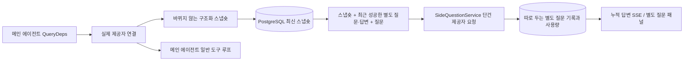

# ARTEX `/btw`

일반 대화, 작업의 메인 에이전트, 현재 작업의 워커에서 따로 떨어진 별도 질문을 할 수 있다. 메인 입력 칸에 `/btw 질문`을 입력하면 제출되고, 빈 `/btw`나 '별도 질문' 버튼은 기록을 연다. 데스크톱은 너비를 조절할 수 있는 사이드 패널을, 모바일은 Drawer를 쓴다.

별도 질문의 답변은 제출 시점의 에이전트 컨텍스트 스냅숏으로 만든다. 스트리밍 표시, 이어서 묻기, 중지, 비우기를 지원한다. 패널을 닫거나 페이지를 새로 고치거나 SSE 연결이 끊겨도 모델 요청은 취소되지 않는다. 중지는 현재 별도 질문에만 영향을 준다. 비우기는 별도 질문을 취소하고 그 기록을 지우지만 메인 컨텍스트 스냅숏은 남긴다.

## 구현 범위

Go, norma v0.3.7, Next.js와 기존 Markdown / ResizablePanel / Drawer / AlertDialog 컴포넌트를 그대로 쓴다. norma 소스를 고치거나 별도 질문을 위해 의존성을 더하지 않았다. 플래너, 다른 작업에서 이어받은 워커, 도구형 하위 작업 업그레이드는 이번 범위에 없다.

- `capture.go`는 `Options.Deps.CallModel / CallModelSync`에서만 메인 루프 요청을 표시한다. 제공자 데코레이터는 구체 모델 안쪽, 라우팅 풀이 바깥에서 고른 뒤에 있으므로 실제로 고른 모델을 기록한다. 압축 요청과 요약 요청은 스냅숏을 덮어쓰지 않는다.
- 요청 시작, 완성된 모델 응답, 실행 종료 상태에서 스냅숏을 발행한다. 생성 중인 반쪽 응답은 발행하지 않는다. 도구 호출은 norma의 `MessagesForAPI`로 짝을 유지하고, 도구 결과는 다음 메인 모델 요청이나 실행 종료 상태에서 스냅숏에 들어간다. 스트리밍이 중단되면 직전의 유효한 경계를 유지한다.
- 스냅숏은 JSON 깊은 복사로 구조화 메시지, 시스템 프롬프트, 도구 정의, 생성 파라미터를 보존한다. 모델 추론 중에는 스냅숏 잠금이나 데이터베이스 트랜잭션을 잡지 않는다.
- `SideQuestionService`는 구체 제공자를 호출한다. 필요하면 별도 질문 요약을 먼저 만든다. 최종 답변은 첫 시도에서 컨텍스트 한도를 넘었고 아직 텍스트나 도구 호출을 출력하지 않았을 때만 줄여서 한 번 재시도할 수 있다. agent session을 만들지 않고, 도구 실행기, 메인 transcript, 활동 피드, 작업 그래프에 연결하지 않으며, 작업 모델 전환 체인도 거치지 않는다. 답변 요청에 도구 정의를 남기는 것은 기존 구조화 도구 컨텍스트와 호환하기 위해서다. 요약 요청에는 도구를 주지 않는다. 새로 돌아온 도구 호출에는 실행 경로가 없다.
- 부모 세션마다 실행 중인 요청은 하나, 서비스 프로세스 하나에 최대 네 개이고, 한 번의 시간 제한은 120초다. 별도 질문은 서비스 수명 주기에 묶인 별도의 취소 컨텍스트를 쓴다.
- 별도 질문 요청은 LLM 프로필 참조와 민감하지 않은 식별 정보 요약만 보관하고, 요청할 때 기존 설정에서 자격 증명을 가져온다. 프로필이 삭제되거나 모델, 프로토콜, 주소 같은 식별 필드가 바뀌면 메인 에이전트를 먼저 실행해 스냅숏을 갱신해야 한다. 테스트는 제품의 기본 모델을 바꾸지 않는다.

## 저장과 복구

`db/schema.sql`이 `side_question_sessions`와 `side_question_requests`를 자동으로 만든다. 앞의 것은 부모 리소스, 최신 스냅숏, 실행 번호, 버전, 정리 버전을 저장한다. 뒤의 것은 질문, 누적 답변, 상태, 모델, 스냅숏 시각, 사용량, 이벤트 순번, 페이지 순번을 저장한다.

부모 세션 키는 conversation ID, 또는 task ID + exploration ID + intent ID다. 워커는 다시 쓰일 수 있는 실행 슬롯 이름을 키로 쓰지 않는다.

스냅숏은 부모 세션별로 합쳐 쓰고 250 ms마다 반영한다. 데이터베이스가 `(run_id, version)`을 비교해 이전 버전이 덮어쓰지 못하게 한다. 별도 질문을 제출하기 전에 고른 스냅숏을 한 번 더 저장한다. 저장에 성공하면 메모리의 큰 스냅숏을 놓고, 실패하면 쓸 버전을 남겨 둔다. 답변 누적 내용은 스트리밍 이벤트가 올 때 최대 250 ms마다 한 번 쓰고, 종료 상태는 바로 저장하며 데이터베이스 오류가 나면 정해진 횟수만큼 재시도한다.

서비스가 시작하면 남아 있던 `running` 요청을 `interrupted`로 표시한다. 이미 저장한 부분 답변과 사용량은 남기고 요청을 자동으로 다시 보내지 않는다. 가장 최근에 성공적으로 저장한 컨텍스트는 다음 질문에 바로 쓸 수 있다. 이전 세션에 스냅숏이 없으면 메인 에이전트를 먼저 실행해야 하고, UI 활동 기록으로 컨텍스트를 다시 만들지 않는다.

비우기는 정리 버전을 올리고 요청을 지운다. 조건부 업데이트가 늦게 도착한 콜백이 다시 쓰지 못하게 막는다. 부모 리소스의 영구 삭제는 외래 키 연쇄 삭제에 맡긴다. 워커 소프트 삭제는 같은 트랜잭션에서 별도 질문 데이터를 지우고, 나중에 늦게 오는 스냅숏을 거부한다. 작업 보관은 먼저 새 요청을 막고, 메인 흐름이 멈추기를 기다린 뒤, 별도 질문을 취소하고 저장이 끝나기를 기다린다. 보관 형식은 v3이고, 별도 질문 테이블이 없는 v1/v2도 읽을 수 있다.

기록은 모두 저장하고, 순번 커서로 한 페이지에 최대 20건을 돌려준다. 모델 요청에는 최근 성공한 질문·답변 최대 20쌍의 원문을 다시 넣되, 넣는 양은 토큰 예산으로 제한한다. 더 오래된 질문·답변은 따로 유지하는 롤링 요약에 담는다. 메인 컨텍스트가 예산을 넘으면 별도 질문용 사본의 오래된 부분만 요약하고, 최근의 구조화 도구 호출과 결과는 남긴다. 요약, 준비 진행 상황, 사용량도 별도 질문의 동시 실행 제한, 취소, 120초 시간 제한을 함께 따른다. 자세한 내용은 [컨텍스트 예산과 오픈 소스 참고 자료](CONTEXT_BUDGET.md)에 있다.

## HTTP 계약

아래 경로를 `{parent}`로 쓰고, 기존 인증과 리소스 검사를 그대로 따른다:

- `/api/conversations/{id}`
- `/api/tasks/{id}/chat`
- `/api/tasks/{id}/intents/{iid}`

| 요청 | 응답과 동작 |
| --- | --- |
| `GET {parent}/side-questions?before={ordinal}` | 최신순 `items`, 따로 두는 `current` 실행 상태, `snapshot` 메타 정보, `next_cursor`. 커서가 0이면 최신 페이지 / 다음 페이지 없음 |
| `POST {parent}/side-questions` | JSON `{ "question": "…", "client_request_id": "UUID" }`. 새 요청은 202와 요청 객체를 돌려준다. 같은 ID와 질문이면 기존 객체를 200으로 돌려준다 |
| `DELETE {parent}/side-questions` | 현재 부모 세션의 별도 질문·답변을 취소하고 비운다 |
| `GET /api/side-questions/{requestID}/events` | `snapshot` SSE 이벤트. `id`는 늘어나는 순번이고 `data`는 누적된 전체 요청 객체다. 비우면 `cleared`를 보낸다 |
| `POST /api/side-questions/{requestID}/cancel` | 명시적 취소. 종료 상태는 기록이나 SSE로 읽는다 |

질문은 최대 4000자다. 스냅숏이 없거나, LLM 프로필이 바뀌었거나, 같은 부모 세션이 사용 중이거나, 멱등 ID가 충돌하면 409를 돌려준다. 전역 동시 실행 한도에 걸리면 429를 돌려준다. SSE 연결마다 누적 상태를 먼저 보내므로 클라이언트가 앞서 받은 텍스트 조각에 기대지 않는다. 프런트엔드는 요청 ID + 순번으로 합치고, 부모 세션을 바꾸거나 비우면 이전 콜백을 버린다.

## 검증과 참고 자료

자동 검사, 실제 모델 사용, 알려진 제약은 [VALIDATION.md](VALIDATION.md)에 있다.

별도 요청 방식은 [Grok CLI side-question.ts(고정 커밋)](https://github.com/superagent-ai/grok-cli/blob/fb97af83f06dca873281d60168430f06c8de6324/src/utils/side-question.ts)를, 실행 격리는 [OpenCode(고정 커밋)](https://github.com/anomalyco/opencode/tree/b3f1a96c6dd7adeb28b36dd11add1998fc84d67b)를 참고했다. ARTEX의 컨텍스트는 norma의 구조화 메시지를 쓰며, 프런트엔드 로그에서 텍스트를 이어 붙이는 방식은 쓰지 않았다.
