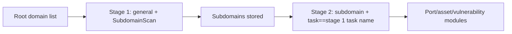

---

## name: scopesentry-mcp
description: Manage the security scanning platform (projects, tasks, templates, assets, nodes) through the ScopeSentry MCP. Use it when the user mentions ScopeSentry, MCP, API Key, scan tasks, or asset queries.

# ScopeSentry MCP Usage Guide

For users with an **already deployed ScopeSentry instance**. Connect to the platform through Cursor (or another MCP client); no local source code required.

## 1. Preparation

### 1.1 Confirm the service is reachable

- Default web interface: `http://<host>`
- MCP endpoint: `http://<host>/mcp` (if there is a reverse proxy or front-end proxy in front, use the actual `/mcp` address)

### 1.2 Create an API Key

1. Log in to the ScopeSentry web interface in a browser
2. Go to the **API Key** management page and create a key (or create one through an interface provided by an administrator)
3. Save the returned `ssk_...` string (**shown only once**)

### 1.3 Configure Cursor MCP

Cursor → Settings → MCP → add a server:

```json
{
  "mcpServers": {
    "scopesentry": {
      "url": "http://<your-host>:8082/mcp",
      "headers": {
        "X-API-Key": "ssk_your-key"
      }
    }
  }
}
```

You can also use: `Authorization: Bearer ssk_your-key`

After configuring, restart the MCP or reload Cursor, and confirm that tools such as `list_projects` and `list_assets` appear in the tool list.

---

## 2. Tool overview


| Tool                   | Purpose             |
| ---------------------- | ----------------- |
| `list_projects`        | Project tree grouped by tag (includes project ID) |
| `list_projects_data`   | Paginated project list, searchable by name     |
| `get_project`          | Project details              |
| `create_project`       | Create a project              |
| `list_tasks`           | Scan task list            |
| `get_task`             | Task details              |
| `list_scan_templates`  | Scan template list            |
| `get_scan_template`    | Template details              |
| `list_plugin_modules`  | Scan pipeline module names          |
| `list_plugins`         | Available plugins (includes hash, default parameters) |
| `create_scan_template` | Create a scan template            |
| `create_scan_task`     | Create a scan task            |
| `list_assets`          | Query assets of various kinds (paginated list)       |
| `count_assets`         | Count the number of assets (`/api/assets/common/total`) |
| `get_asset_detail`     | Asset or vulnerability details           |
| `add_asset_tag`        | Add a tag to an asset           |
| `list_nodes`           | Scan node list            |


The parameters of each tool follow the MCP tool description (schema); the search and filter syntax of `list_assets` / `count_assets` is identical, and you can read the `list_assets` description before querying assets.

When you need to know "how many entries in total," use `count_assets` (corresponding to the web pagination total interface); there is no need to page through `list_assets` repeatedly just to count the total.

---

## 3. Common workflows

### 3.1 Query assets by project

When the user or context **already has a project condition**, prefer passing `filter.project` to narrow the scope and avoid slow responses caused by too much cross-project data. If there is no explicit project, you do not have to force a project filter.

1. Use `list_projects` or `list_projects_data` to get the target project's **ObjectID** (`id` / `children[].value`)
2. Pass `filter.project` to `list_assets` (**must be an ID, not the project's display name**)

```json
{
  "asset_type": "asset",
  "pageIndex": 1,
  "pageSize": 20,
  "search": "domain=^example.com",
  "filter": {
    "project": ["<project-ObjectID>"]
  }
}
```

### 3.2 Create a scan task

1. Use `list_nodes` to get the names of online nodes
2. Use `list_scan_templates` or `create_scan_template` to get the template **ObjectID**
3. `create_scan_task`: `name` and `node` are required; `template` takes the template ID (not the template name)

**Target source `targetSource` (consistent with the web side):**

| targetSource | Description | Required parameters |
| --- | --- | --- |
| `general` | Enter targets directly | `target` |
| `project` | Read targets from a project | `project` (array of project ObjectIDs) |
| `asset` | Search from the web asset library | `search`; optional `project`, `filter`, `targetNumber` |
| `RootDomain` | Search from the root domain library | `search`; optional `project`, `filter`, `targetNumber` |
| `subdomain` | Search from the subdomain library | `search`; optional `project`, `filter`, `targetNumber` |
| `UrlScan` | Search from URL scan results | `search`; optional `project`, `filter`, `targetNumber` |
| `*Source` (e.g. `subdomainSource`) | Create from "selected/searched" on the asset page | use `search` when `targetTp=search`; use `targetIds` when `targetTp=select` |

**Example — scan root domains directly:**

```json
{
  "name": "example-subdomain-collection",
  "node": ["node-1"],
  "template": "<template-ObjectID>",
  "targetSource": "general",
  "target": "example.com\nfoo.com",
  "project": ["<project-ObjectID>"]
}
```

**Example — continue scanning from the subdomain library (filter by the previous task name):**

```json
{
  "name": "example-ports-and-vulnerabilities",
  "node": ["node-1"],
  "template": "<follow-up-module-template-ObjectID>",
  "targetSource": "subdomain",
  "search": "task==\"example-subdomain-collection\"",
  "project": ["<project-ObjectID>"]
}
```

### 3.3 Full information gathering for a root domain (two-stage recommended)

When the input is a **root domain** and you want to perform **full information gathering**, it is recommended to scan in two passes rather than running the whole pipeline at once.

**Reason:** A distributed task is dispatched in units of a **single target**. When a root domain is the target, after a node is assigned that root domain, the subdomains discovered on that node also continue to run the follow-up modules on the same node, which easily causes load imbalance, slow speed, and errors.

**Best practice:**

1. **Stage 1 — subdomain collection only**
   - `targetSource`: `general`
   - `target`: all root domains (multiple lines)
   - Template: enable only `SubdomainScan` and `SubdomainSecurity` (subdomain scan + subdomain takeover)
   - Use `get_task` to wait for the task to complete

2. **Stage 2 — follow-up modules**
   - `targetSource`: `subdomain`
   - `search`: `task=="<stage 1 task name>"` (exact match on the task name)
   - Optional `project` to narrow the scope
   - Template: port scan, asset mapping, vulnerability scan, etc. (may exclude SubdomainScan)
   - Subdomains are dispatched to nodes as independent targets, giving higher parallel efficiency

You can also filter by task name on the "Subdomain" asset page in the web interface and then use "Create task from subdomains"; the effect is the same.



### 3.4 Create a scan template

1. `list_plugin_modules` → list of module names
2. `list_plugins` (filterable by `module`) → each plugin's `hash` and default `parameter`
3. `create_scan_template`: use `modules` to specify "module → array of plugin hashes"

---

## 4. Asset queries (`list_assets` / `count_assets`)

`count_assets` uses the same `asset_type`, `search`, and `filter` as `list_assets`, and returns `{ "total": N }`, corresponding to the web side's `/api/assets/common/total`.

```json
{
  "asset_type": "subdomain",
  "search": "task==\"some task name\"",
  "filter": {"project": ["<project-ObjectID>"]}
}
```

**Performance advice (common to `list_assets` / `count_assets`):** When there is a project condition, prefer `filter.project` to narrow the scope; in `search`, use `==` exact match or `^` prefix match as much as possible for indexed fields (see [4.3](#43-search-search-expressions)), and avoid broad `=` fuzzy queries that slow down responses. When there is no project context, do not force a project filter.

See the table in [4.4](#44-filter-exact-filtering) for the types that support `filter.project`.

### 4.1 Asset types `asset_type`

`asset`, `RootDomain`, `subdomain`, `app`, `mp`, `UrlScan`, `SensitiveResult`, `DirScanResult`, `crawler`, `vulnerability`, `PageMonitoring`, `IPAsset`, `SubdomainTakerResult`

Alias examples: `web`→asset, `vuln`→vulnerability, `ip`→IPAsset, `url`→UrlScan

### 4.2 Parameter descriptions


| Parameter                | Description                             |
| ------------------------ | --------------------------------------- |
| `pageIndex` / `pageSize` | Pagination, default 1 / 20                            |
| `search`                 | Search expression (see next section)                              |
| `filter`                 | Exact filter JSON (see next section)                          |
| `sort`                   | Only UrlScan and DirScanResult support sorting by `length` |
| `sid`                    | SensitiveResult only: sensitive rule name                |


`search` and `filter` **can be used together**.

### 4.3 search search expressions

A custom DSL (**not SQL**):


| Operator | Meaning | Index | Example                      |
| ---- | ---- | ---- | --------------------------- |
| `=`  | Fuzzy match (regex) | Not indexed | `domain=example`            |
| `==` | Exact match (equals) | **Indexed** | `port==443`                 |
| `!=` | Exclude | — | `port!="80"`                |
| `&&` | AND | — | `domain==example.com && port==443` |
| `||` | OR | — | `title=admin || body=login` |


**Indexes and operators:** Fields such as `domain`, `ip`, `port`, and `title` are indexed, but only **`==` exact match** or a **prefix match whose value starts with `^`** (e.g. `domain=^example.com`) can use the index; **`=` is converted to a regex fuzzy match and cannot use the index**, which easily becomes slow on large data volumes.

**search fields common to all types:** `tag`, `task` (task name), `rootDomain`

**`project` cannot be written in `search`** (it is invalid, or errors when combined with `&&`). To filter by project, use `filter.project`.

**Common search fields per type:**


| asset_type           | Fields                                                                              |
| -------------------- | ----------------------------------------------------------------------------------- |
| asset                | domain, ip, port, service, app, title, statuscode, icon, banner, type, body, header |
| RootDomain           | domain, icp, company                                                                |
| subdomain            | domain, ip, type, value                                                             |
| app                  | name, icp, company, category, description, url, apk                                 |
| mp                   | name, icp, company, category, description, url                                      |
| UrlScan              | url, input, source, resultId, type                                                  |
| SensitiveResult      | url, sname, body, info, md5                                                         |
| DirScanResult        | url, statuscode, redirect, length                                                   |
| vulnerability        | url, vulname, matched, request, response, level                                     |
| crawler              | url, method, body, resultId                                                         |
| PageMonitoring       | url, hash, diff, response                                                           |
| IPAsset              | ip, domain, port, service, webServer, app                                           |
| SubdomainTakerResult | domain, value, type, response                                                       |


**search examples:**

- `domain==www.example.com && port==443` (exact match, uses index)
- `domain=^example.com` (prefix match, uses index)
- `ip==192.168.1.1`
- `task=="some task name"`
- `level==high` (vulnerability)
- `statuscode==200` (DirScanResult)

When you need a fuzzy "contains," use `=`, such as `title=admin` (not indexed; best combined with a project or other condition to narrow the scope).

### 4.4 filter exact filtering

A JSON object: multiple values for the same key are **OR**, different keys are **AND**.

**Prefer `project` when there is a project condition:** If the user or context has an explicit project and the asset_type supports `project`, include it to narrow the scope; when there is no project information, do not force it.


| filter key   | Meaning    | Value notes                                              |
| ------------ | -------- | -------------------------------------------------------- |
| `project`    | Owning project | **ObjectID**, obtained via `list_projects` / `list_projects_data` |
| `task`       | Source task | **Task name**, from the `name` field of `list_tasks`     |
| `port`       | Port     | e.g. `"443"`                                             |
| `service`    | Service/protocol | e.g. `"https"`                                           |
| `app`        | Application fingerprint | e.g. `"Nginx"`                                           |
| `icon`       | Icon hash |                                                          |
| `statuscode` | HTTP status code | Mainly for asset                                         |
| `status`     | Status   | UrlScan/DirScan HTTP code; vulnerability/sensitive-info handling status |
| `level`      | Vulnerability level | critical / high / medium / low / info                    |
| `type`       | Type     | e.g. subdomain record type A, CNAME                      |
| `color`      | Sensitive rule color | SensitiveResult                                          |
| `sname`      | Sensitive rule name | SensitiveResult                                          |
| `tags`       | Tags     |                                                          |


**Available filter keys per type:**


| asset_type                            | filter key                                                      |
| ------------------------------------- | --------------------------------------------------------------- |
| asset                                 | project, port, service, app, icon, statuscode, type, task, tags |
| RootDomain                            | project, tags                                                   |
| subdomain                             | project, type, task, tags                                       |
| app / mp                              | project, tags                                                   |
| UrlScan                               | status, tags                                                    |
| DirScanResult                         | status, tags                                                    |
| SensitiveResult                       | status, color, sname, tags                                      |
| crawler                               | project, task, tags                                             |
| vulnerability                         | project, level, status, task, tags                              |
| PageMonitoring / SubdomainTakerResult | tags                                                            |
| IPAsset                               | project, port, service, app                                     |


**filter example:**

```json
{"project": ["<project-ObjectID>"], "port": ["443"]}
```

**Combined query example:**

```json
{
  "asset_type": "asset",
  "search": "domain=^baidu && port==443",
  "filter": {"project": ["<project-ObjectID>"]},
  "pageIndex": 1,
  "pageSize": 10
}
```

**Notes:**

- Prefer `filter.project` when there is a project condition (when supported); when there is no project context, it is not required
- Do not put the project's display name in `filter.project`
- Use `==` for known values and `^` for prefixes; avoid overusing `=` fuzzy match on large tables
- For UrlScan's HTTP status, use `filter.status`; for DirScanResult you can use `statuscode==200` in search
- For SensitiveResult by rule name: use `sname=rule-name` in `search`, or `filter.sname`

### 4.5 sort

Only **UrlScan** and **DirScanResult** support it:

```json
{"length": "ascending"}
```

Other types ignore `sort` and use the default ordering by time.

---

## 5. Scan template module names

`TargetHandler`, `SubdomainScan`, `SubdomainSecurity`, `PortScanPreparation`, `PortScan`, `PortFingerprint`, `AssetMapping`, `AssetHandle`, `URLScan`, `WebCrawler`, `URLSecurity`, `DirScan`, `VulnerabilityScan`, `PassiveScan`

---

## 6. Troubleshooting


| Symptom     | Handling                                           |
| --------- | -------------------------------------------------- |
| MCP shows no tools | Check the URL, API Key, and whether ScopeSentry is running |
| 401 / 403 | Recreate or replace the API Key                    |
| Assets not found | Confirm `filter.project` is an ObjectID; do not write project in search |
| Template/task creation fails | `template` must be a template ObjectID; `node` takes an online node name |
| Query is slow / hangs | Add `filter.project` when there is a project; in search use `==` or `^` prefix for indexed fields and use `=` less; reduce `pageSize` |


---

